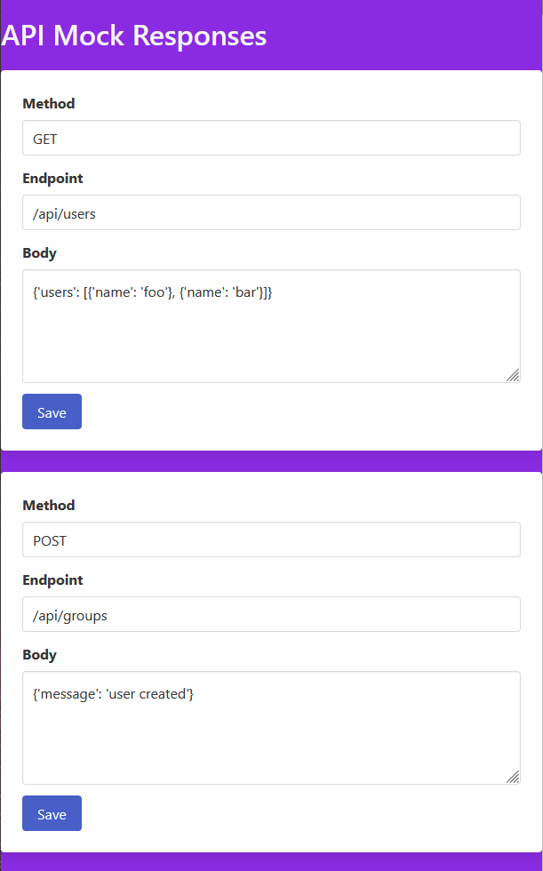

# api-mock-responses

Utilize este pequeno APP para simular uma API fake, que retorna dados mocados
em qualquer endpoint préviamente configurado.

## Stack

- [FastAPI](https://fastapi.tiangolo.com/)
- [Jinja2](https://jinja.palletsprojects.com/en/3.0.x/)
- [Bulma](https://bulma.io/)
